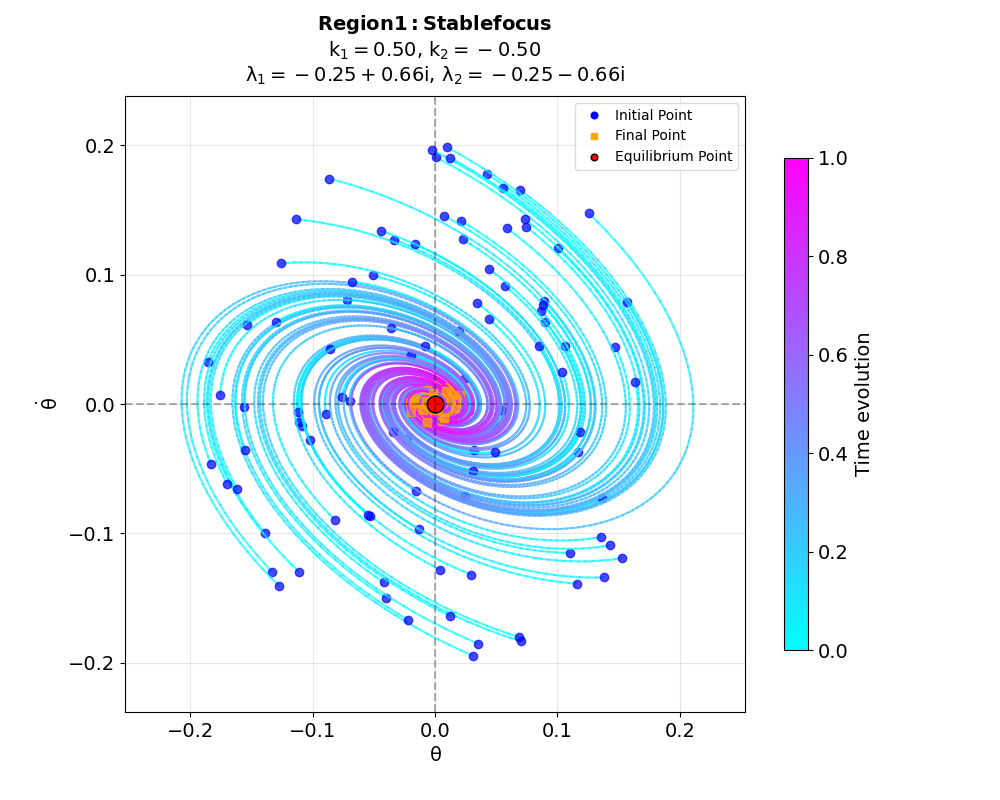

# Advanced Control Methods 2025

This repository contains materials for the Advanced Control Methods course.

## Repository Structure

*   `/seminars`: Contains materials for each seminar, including Jupyter notebooks (`.ipynb`), theoretical notes (`.md` files where applicable), source code (`src/`), and images (`img/`). Each seminar directory has its own `README.md` detailing its content.
*   `/lectures`: Intended for lecture slides or notes.

## Lectures
Lecture | Materials |
| ----- | ----- |
| Lecture 1. |  |
| Lecture 2. |  |
| Lecture 3. |  |
| Lecture 4. |  |
| Lecture 5. |  |
| Lecture 6. |  |
| Lecture 7. |  |

## Seminars
Seminar | Materials |
| ----- | ----- |
| Seminar 1. Bang-Bang Control | [Seminar 1 Details](seminars/seminar_1_bang_bang/) |
| Seminar 2. Point Motion & Linear Transformations | [Seminar 2 Details](seminars/seminar_2_circular_motion/) |
| Seminar 3. Lyapunov Stability (Pendulum Down) | [Seminar 3 Details](seminars/seminar_3_lyapunov_1_pendulum_down/) |
| Seminar 4. Lyapunov Stability & Stabilization (Pendulum Up) | [Seminar 4 Details](seminars/seminar_4_lyapunov_2_pendulum_up/) |
| Seminar 5. Adaptive Control (1D System) | [Seminar 5 Details](seminars/seminar_5_adaptive/) |
*Note all the seminars are saved in the `seminars` directory.*

## Notation Convention

Throughout the seminars and lectures, the following general notation is used where applicable:

*   $\mathbf{s}$: State vector of the system.
*   $a$: Control input signal.
*   $L$: Lyapunov function candidate.

## Welcome Note

<!-- region_1_simulation -->
Throughout this course, your focus should be stable - just like Region 1 above!
<!-- endregion_1_simulation -->

## Recommended References

For further reading and a deeper understanding of the topics covered in the lectures and seminars, the following books are recommended:

*   **Nonlinear Dynamics & Stability Introduction:**
    *   Strogatz, S. H. (2015). *Nonlinear Dynamics and Chaos: With Applications to Physics, Biology, Chemistry, and Engineering*. Westview Press. (Excellent for intuition and phase plane analysis)
*   **Linear Control Systems:**
    *   Ogata, K. (2010). *Modern Control Engineering*. Prentice Hall. (Classic textbook for linear systems analysis and design)
*   **Nonlinear Systems & Lyapunov Stability:**
    *   Khalil, H. K. (2002). *Nonlinear Systems*. Prentice Hall. (Comprehensive reference for Lyapunov theory and nonlinear control)
*   **Adaptive Control:**
    *   Åström, K. J., & Wittenmark, B. (2008). *Adaptive Control*. Dover Publications. (Classic text on adaptive systems) 