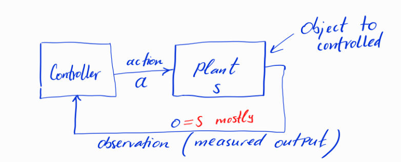

# Control Systems Dynamics and Lyapunov Theory

## System Architecture

A control system consists of two primary components:
- **Controller**: Generates control actions based on observations
- **Plant**: The object to be controlled

The typical flow is:
1. Controller sends action `a` to the plant
2. Plant state `s` changes according to dynamics
3. Controller receives observations `o` (typically `o = s` or a function of `s`)
4. Process repeats

In a block diagram, this would be represented as a Controller block connected to a Plant block with:
- Forward arrow from Controller to Plant labeled "action a"
- Feedback arrow from Plant to Controller labeled "observation o = s (mostly)"

## Plant Dynamics

A plant represents a dynamical system with:
- State $s \in \mathbb{R}^n$
- Time evolution along a trajectory

### Transition Law

The transition from one state to the next follows:

$s_{t+1} = P(s_t, a_t)$

Where:
- $s_t$ is the current state
- $a_t$ is the action applied at time $t$

### Continuous Time Dynamics

In continuous time systems, we typically represent the dynamics as:

$$\dot{s} = P(s, a)$$

Where $\dot{s}$ represents the time derivative $\frac{ds}{dt}$.

When discretized with step size $\Delta t$, this becomes:

$$s_{t+1} = s_t + \Delta t \cdot P(s_t, a_t)$$

## Lyapunov Function Analysis

For a candidate Lyapunov function $L(s)$, we can analyze stability through two approaches:

In control theory, Lyapunov functions are used to analyze system stability. A suitable Lyapunov function will decrease along system trajectories for stable systems.

### Continuous Time Analysis

The time derivative of the Lyapunov function can be calculated as:

$\frac{d}{dt}L(s) = \langle \nabla_s L, \dot{s} \rangle = d_P L$

Where:
- $\nabla_s L$ is the gradient of $L$ with respect to $s$
- $\dot{s}$ is the state derivative (plant dynamics)
- $d_P L$ represents the directional derivative along $P$

The key insight is that if $\frac{d}{dt}L(s) < 0$ for all $s \neq 0$, then the system is asymptotically stable at the origin.

### Discrete Time Analysis

In discrete time, we analyze the change in the Lyapunov function between steps:

$\Delta L_t = L_{t+1} - L_t = L(P(s_t, a_t)) - L(s_t)$

Similarly to the continuous case, if $\Delta L_t < 0$ for all $s_t \neq 0$, then the discrete-time system is asymptotically stable at the origin.

Both approaches provide insights into the stability of the controlled system by examining whether the Lyapunov function decreases over time.