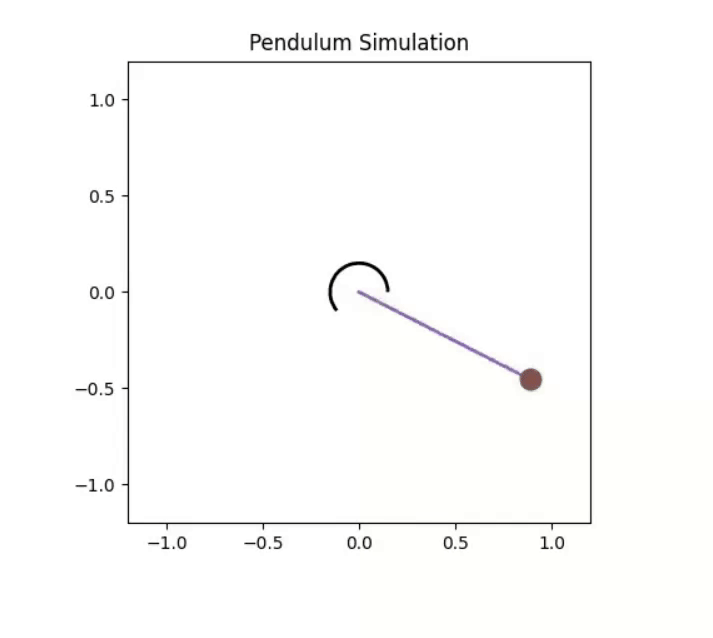

# Lyapunov-Based Control

This directory contains materials related to control design using Lyapunov stability theory.

## Content Overview (`lyapunov_control.md` / `.pdf`)

- **Motivational Example (Pendulum):** Introduces the pendulum system, its state-space representation, and the goal of stabilizing it at the upright position.
- **Energy Approach:** Defines the total energy of the pendulum and introduces a candidate Lyapunov function based on energy.
- **Lyapunov Analysis:** Calculates the time derivative of the candidate Lyapunov function.
- **Controller Design:** Proposes control laws (policies) based on the Lyapunov analysis to make the derivative negative (or non-positive), aiming for stability.
- **Implementation Example:** Briefly outlines a possible software architecture for simulating the system (Plant, Controller, Simulation Loop).
- **Theoretical Background:**
    - Defines equilibrium points and stability concepts (Uniform Asymptotic Stability).
    - Discusses requirements for system dynamics (Lipschitz continuity) and potential issues (trajectory blow-up).
    - Introduces controlled systems and the concept of stabilization using feedback policies.
    - Explains the core idea of Lyapunov-based control: finding a Lyapunov function $L(s)$ such that $L$ is positive definite and its derivative $\dot{L}$ along system trajectories is negative definite (or semi-definite).
    - Defines Class $\mathcal{K}$ and $\mathcal{K}_\infty$ functions used for bounding Lyapunov functions and their derivatives.
    - Discusses Lyapunov function design (LF) and Control Lyapunov Functions (CLF).
    - Mentions LaSalle's Invariance Principle for cases where $\dot{L}$ is only negative semi-definite (related to the final hint about $s_2=0$).

- **`pendulum_control.ipynb`:** A Jupyter Notebook demonstrating the practical implementation and simulation of controlling the pendulum using the concepts discussed (e.g., energy-based Lyapunov controller). Includes Python code for the pendulum dynamics, controller implementation, and visualization.
- **Video Demonstration:** The `img/` subfolder contains a video illustrating the pendulum swing-up using an energy-based approach. It shows the pendulum gaining enough energy to potentially stabilize at the top, even if it doesn't hold the position perfectly in the depicted sequence.

  

**Note:** The Markdown file (`lyapunov_control.md`) is an automatically converted version of the original PDF (`lyapunov_control.pdf`). Please refer to the PDF for definitive accuracy. 