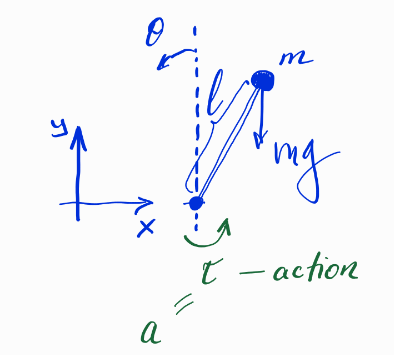
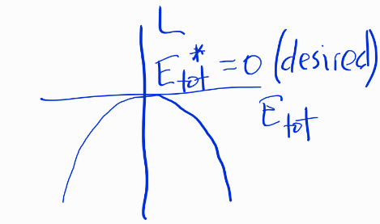

# Motivational Example

## Problem Statement



State of the system:
$s = \begin{pmatrix} \theta \\ \dot{\theta} \end{pmatrix} \text{ — state}$

State variables:
$$s_1 = \theta$$
$$s_2 = \dot{\theta}$$

Equations of motion:
$$\dot{s}_1 = \dot{\theta} = s_2$$
$$\dot{s}_2 = \frac{g}{l}\sin s_1 + \frac{a}{ml^2}$$

State space:
$$s \in \mathbb{R}^2, a \in \mathbb{R}$$

## Goal

To transfer the system from an arbitrary state to:
$$s \rightarrow \begin{pmatrix} 0 \\ 0 \end{pmatrix}$$

Assume there is a bound on the applied torque magnitude.

## Energy Approach

Total energy of the system:
$$E_{tot} = \frac{ml^2s_2^2}{2} + mgl(\cos s_1 - 1)$$

We want to maximize the potential energy.

Introduce the following function:
$$L := -\frac{1}{2}E_{tot}$$

A few facts:
- $L \leq 0$
- $E_{tot}^* = 0$ (desired)



## Lyapunov Analysis

Taking the derivative of L:

$$\dot{L} = -(ml^2s_2 \cdot \dot{s}_2 - mgl \sin s_1 \cdot s_2)$$

$$\dot{L} = -(ml^2s_2(\frac{g}{l}\sin s_1 + \frac{a}{ml^2}) - mgl \sin s_1 \cdot s_2)$$

$$\dot{L} = -E_{tot} s_2 a$$

## Controller Design

Controller: $\pi(s)$ (also called policy)

$$a \leftarrow \pi(s) \; \forall t$$

Given the bound constraints, we can set:
$$a \leftarrow -CE_{tot}s_2, \; C > 0$$

This yields:
$$\dot{L} = CE_{tot}^2s_2^2$$

Alternative controller:
$$a \leftarrow sgn(E_{tot}s_2)$$

We will need a switch (possibly "soft") when the pendulum is close to the upright position.

## Implementation Example

### System Architecture

Abstract Plant ------> Plant Pendulum
    |
    | state
    |
   step

Function of 'step':
- Updates the state using the provided action

'self.step(action)' returns state (new one!)

### Pendulum Class
```
Pendulum
  mass
  length
  inertia
```

### Controller Class
```
Controller
  |
  |
  get_action
```

'self.get_action(observation)'

### Simulation Loop

```
while ...
    state_new = pendulum.step(action)
    action = energy_pid(state_new)
```

## Theoretical Background

$L$ serves as an abstract energy (usually non-negative, but subject to convention).

Consider an arbitrary system:
$$\dot{s} = P(s,a)$$

Points for which:
$$P(s^*,a^*) = 0$$
are called equilibria.

Usually, we assume $a^* = 0$, i.e., under no action, if the plant is in a state $s^*$, it will stay there forever unless some action is applied.

### Types of Equilibria
- Stable
- Unstable

#### Uniform Asymptotic Stability

Definition: A state $s^*$ is called uniformly asymptotically stable if:

1. (Stability) For any $\varepsilon > 0$, there exists $\delta > 0$ such that if $\|s_0\| \leq \delta$, then $\|s(t)\| \leq \varepsilon$ for all $t \geq 0$

2. (Attraction) $\lim_{t \rightarrow \infty} \|s(t) - s^*\| = 0$

Comments:
- $s(t)$ is called a trajectory
- For a given initial state $s_0$, $s(t)$ is a solution of the respective initial value problem:
  $$\dot{s} = P(s)$$
  $$s(0) = s_0$$

We should be particularly careful with trajectories as they may fail to exist or may be non-unique.

For an adequate mathematical description of the plant, $P$ must be at least locally Lipschitz:

For any compact $S' \subset S$, there exists Lip constant such that:
$$\forall s, s' \in S': \|P(s) - P(s')\| \leq \text{Lip}\|s - s'\|$$

This means $P$ is not "too steep" in state space.

A trajectory may exist for some period of time, say $[0, \tau)$, but fail to exist after — it's called a "blow-up".

### Controlled Systems

Now, let's consider instead of an autonomous system $\dot{s} = P(s)$ a controlled plant $\dot{s} = P(s,a)$.

The good news is that if the uncontrolled plant $\dot{s} = P(s,0)$ had nasty properties like trajectory blow-up, applying some policy $\pi$ might result in an autonomous plant:

$$\dot{s} = P(s, \pi(s)) = P'(s)$$

(also called closed-loop) which is "well-behaved".

The bad news is that a bad policy might also destroy the good properties.

Designing good policies is our primary task.

### Stabilization

One of the key objectives of control is stabilization:

Suppose you have some desired equilibrium $s^*$ which happens to be unstable. Recall the pendulum example: if it's upright, applying the slightest action and then zeroing it immediately leads to the loss of balance.

So, we want $s^*$ to become a stable (e.g., uniformly asymptotically) equilibrium of the closed loop:

$$\dot{s} = P(s,\pi(s))$$

by a wise design of the policy $\pi$.

### Lyapunov-based Control

How do we check the stability condition? One way is to linearize the plant around the equilibrium in question and study the eigenvalues of the closed-loop state transition matrix:

$$\dot{s} = P(s,a) \text{ gets } \dot{s} = As + Ba$$

Set $\pi(s) := -Ks$ and force the eigenvalues of $(A-BK)$ to lie in the left half-plane.

But such a method only works as much. Even upswinging the pendulum is not doable like that.

Instead, we resort to a much more powerful and advanced technique called Lyapunov-based control.

First of all, let's consider an autonomous plant:
$$\dot{s} = P(s)$$

Suppose, for simplicity, $s^* = 0$ is an equilibrium point.

Now comes the art:
Assume we are able to find a scalar function $L: S' \rightarrow \mathbb{R}$ with $S' \subset S$ compact such that for all $s \in S'$:

1. $K_l(\|s\|) \leq L(s) \leq K_u(\|s\|)$
2. $\dot{L} \leq -K_d(\|s\|)$

where the "kappas" (with indices "l" for "low", "u" for "up", "d" for "decay") are so-called kappa functions (or class $\mathcal{K}$ functions).

Definition: A function $K: \mathbb{R} \rightarrow \mathbb{R}$ is called a class $\mathcal{K}$ function if:
1. $K(0) = 0$
2. $K$ is monotonically increasing

It's called a class $\mathcal{K}_\infty$ function if, additionally:
$$\lim_{x \rightarrow \infty} K(x) = \infty$$

Kappa and kappa-infinity functions are powerful tools to study stability and design advanced policies.

So, if the said $L$ exists, then $s = 0$ is uniformly asymptotically stable!

Moreover, if $K_l$ and $K_u$ are $\mathcal{K}_\infty$, then $s = 0$ is globally uniformly asymptotically stable, meaning, if $S = \mathbb{R}^n$, $n \in \mathbb{N}$, then no matter where we start, we will eventually get into the equilibrium.

### Lyapunov Function Design

We pick a candidate(!) $L$, write down $\dot{L}$ and try to figure out what to plug for $a$ to make $\dot{L} < 0$.

Such an $L$ is called a Lyapunov function for the (autonomous, closed-loop) plant (named after the founding father of the stability theory of differential equations Alexander Lyapunov).

A candidate $L$ for which an action $a$ exists at each state $s$ is called a control Lyapunov function.

Abbreviations: LF, CLF

Common recipes for candidate LFs:
$\|s\|^2$, $\sum_i |s_i|$, $\sum_i \int_c^{s_i} f(s_i) ds_i$, etc.

It's always an art!

Remarks: As said before, taking $L \geq 0$ and $\dot{L} < 0$ is just a convention (cf. inv. pendulum). For non-strict LFs (where not "exactly" kappa functions are findable), there exist techniques to still show stability.

Look back at the pendulum example. Exactly what can we show using our suggested $L$? What if $s_2 = 0$?

Hint: Make an insight into the plant dynamics. What states are those for which $s_2 = 0$? What if the position is not upright, but the angular velocity happens to be zero?