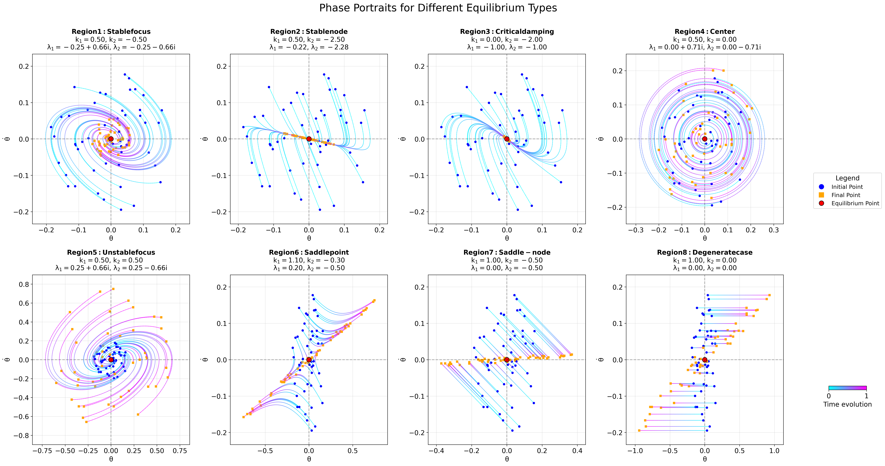

# Seminar 3: Lyapunov Stability Analysis for Pendulum (Lower Equilibrium)

This seminar focuses on analyzing the stability of the lower equilibrium point ($\theta=0$) of a simple pendulum under linear feedback control using Lyapunov's first method (linearization) and visualizing the results.

## Contents

1.  **Pendulum Model:** Linearization around the lower equilibrium and derivation of the system matrix under linear control.
2.  **Stability Analysis:** Classification of the equilibrium point based on eigenvalues, determinant, trace, and discriminant of the system matrix depending on control gains ($k_1, k_2$).
3.  **Visualization:** Plotting the stability map in the ($k_1, k_2$) plane and phase portraits for different regions.
4.  **Lyapunov Theory:** Introduction to Lyapunov's first (linearization) and second (direct) methods.

## Key Topics

*   Pendulum Dynamics
*   Linear Feedback Control
*   Linearization around Equilibrium
*   Stability Analysis of Linear Systems
*   Eigenvalues, Determinant, Trace, Discriminant
*   Classification of Equilibrium Points (Node, Focus, Saddle, Center)
*   Stability Maps (Parameter Space Analysis)
*   Phase Portraits
*   Lyapunov's First and Second Methods

## Mathematical Foundation

*   State Vector: $\mathbf{s} = [\theta, \dot{\theta}]^T$
*   Control Law: $a(t) = k_1 \theta + k_2 \dot{\theta}$
*   Linearized System: $\dot{\mathbf{s}} = A \mathbf{s}$, with $A = \begin{pmatrix} 0 & 1 \\ -1 + k_1 & k_2 \end{pmatrix}$
*   Stability Conditions based on $\det(A)$, $\text{tr}(A)$, $\Delta = \text{tr}(A)^2 - 4\det(A)$

## Files in Directory

*   `seminar_3_solution.ipynb`: The main Jupyter Notebook. Includes theory, analysis code, simulation calls, and visualizations.
*   `img/`: Contains generated visualizations:
    *   `equilibrium_types_collage.png`: Collage showing phase portraits for different stability regions.
    *   `region_*.png`: Individual phase portrait plots for different regions (1-8).
    *   `stability_regions.png` (or similar) if the stability map is saved.
*   `src/`: Contains Python modules with helper functions imported by the notebook:
    *   `phase.py`: Core functions for system dynamics simulation (using `scipy.integrate.solve_ivp`) and phase portrait plotting.
    *   `stability_analysis.py`: Functions to calculate eigenvalues and classify equilibrium type based on `k1`, `k2`.
    *   `plot_stability_regions.py`: Functions to generate and plot the stability map in the `k1`-`k2` plane.
    *   `visualization.py`: General plotting utilities.
    *   `collage_generator.py`: Script to create the `equilibrium_types_collage.png`.
    *   `analyze.py`, `check_k.py`: Scripts for specific analyses or parameter checks.
*   `README.md`: This file.

## Running the Code

*   **Jupyter Notebook:** Open and run cells in `seminar_3_solution.ipynb`. Needs `numpy`, `matplotlib`, `scipy`.

## Key Visualization: Stability Map & Equilibrium Types

*   **Stability Map:** Shows how equilibrium type/stability depend on control gains $k_1, k_2$.
*   **Equilibrium Types Collage:** (e.g., `img/equilibrium_types_collage.png`) Visual examples of different phase portraits.

_(If the image `img/equilibrium_types_collage.png` exists, it shows examples of phase portraits for different stability regions)_ 