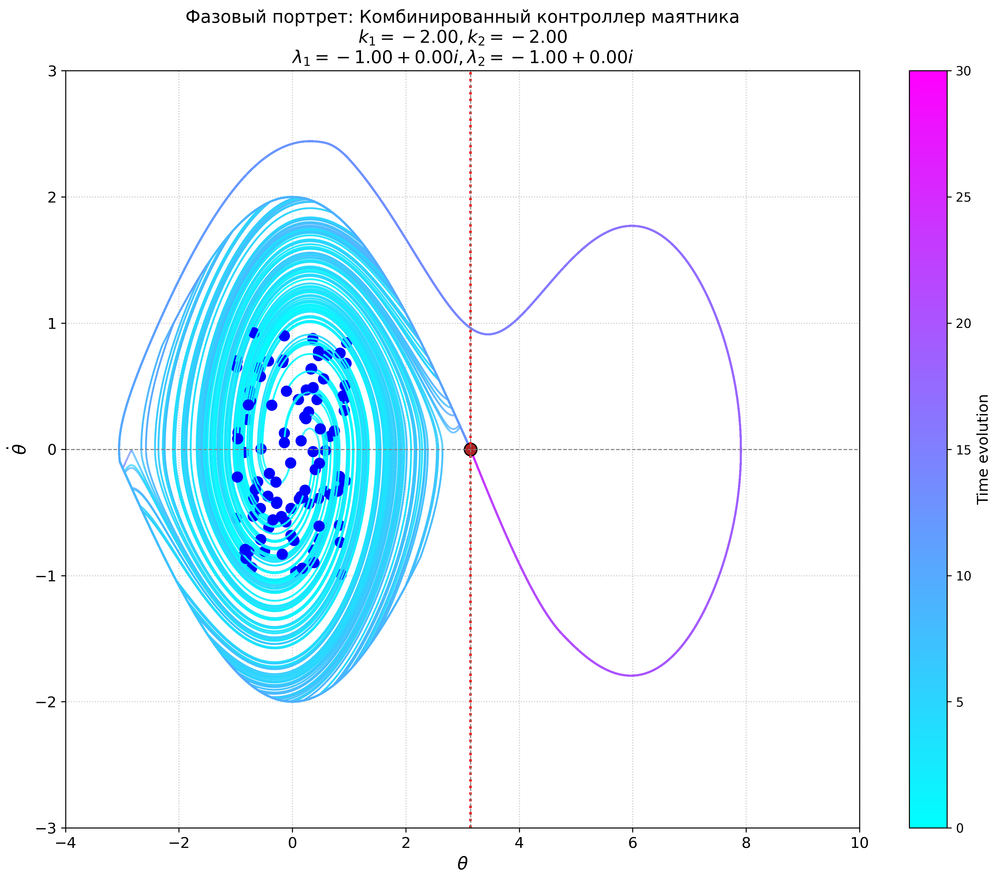

# Seminar 4: Lyapunov Stability and Stabilization of the Inverted Double Pendulum

This seminar focuses on analyzing the stability of dynamical systems using Lyapunov functions and applying these concepts to stabilize an inverted double pendulum, specifically its unstable upper equilibrium position.

## Contents

1.  **Lyapunov Theory:** Introduction to Lyapunov stability (direct method, Lyapunov functions), LaSalle's principle, and application to simple pendulum stability analysis (lower and upper equilibria).
2.  **Stabilization Strategy:** Linearization around the upper equilibrium, design of linear feedback, and combining energy-based swing-up control with linear stabilization for the double pendulum.
3.  **Simulation:** Implementation and visualization of the swing-up and stabilization controllers for the double pendulum, including phase portrait analysis.

## Key Topics

*   Lyapunov Stability (Direct Method)
*   Lyapunov Functions
*   LaSalle's Invariance Principle
*   Pendulum Stability (Upper Equilibrium)
*   Linearization for Control
*   Linear Feedback Stabilization
*   Energy-Based Control (Swing-Up)
*   Hybrid Control (Switching)
*   Double Pendulum Dynamics
*   Phase Portraits

## Mathematical Foundation

*   Lyapunov Function ($L$): Conditions $L(\mathbf{s}) > 0$ for $\mathbf{s} \neq \mathbf{s}_e$, $L(\mathbf{s}_e) = 0$, $\dot{L}(\mathbf{s}) \le 0$.
*   LaSalle's Principle: Convergence to the largest invariant set within $\{ \mathbf{s} | \dot{L}(\mathbf{s}) = 0 \}$.
*   Linear Feedback: $a = K(\mathbf{s} - \mathbf{s}_{target})$.
*   Energy Control Concept: Modify energy $E$ towards target $E_{target}$, e.g., $a \propto (E - E_{target}) \cdot \text{sign}(\dot{\theta}\cos\theta)$ (simplified concept).

## Files in Directory

*   `seminar_4_theory_lyapunov.md`: Provides theoretical background on Lyapunov stability concepts.
*   `seminar_4_theory_pendulum_upper.md`: Focuses on the theory of stabilizing the pendulum's upper equilibrium.
*   `seminar_4_solution.ipynb`: Main Jupyter Notebook demonstrating the practical application. Contains the double pendulum model, implementation of `EnergyControl` and `LinearFeedbackController`, simulation logic, and visualization.
*   `img/`: Contains images for theory files and simulation outputs:
    *   `P_viz.png`, `bad_p_viz.png`: Illustrations for Lyapunov theory.
    *   `energy_control.png`, `upper_position.png`: Related to pendulum control concepts.
    *   `phase_portrait_full.png`: Phase portrait visualization near the upper equilibrium.
*   `src/`: Contains Python modules with core classes:
    *   `system.py`: Defines the abstract base class for dynamical systems.
    *   `pendulum.py`: Implementation of the double pendulum dynamics.
    *   `controller.py`: Defines controller base class and implementations (`EnergyControl`, linear feedback/LQR).
    *   `simulation.py`: Class to run the simulation loop.
    *   `plotter.py`: Utilities for plotting simulation results.
    *   `controller_adaptive.py`: (Unused in this seminar) Adaptive controller implementation.
    *   `__init__.py`: Makes the directory a Python package.
*   `README.md`: This file.

## Running the Code

*   **Jupyter Notebook:** Open and run cells in `seminar_4_solution.ipynb`. Needs `numpy`, `matplotlib`, and relies on the classes defined in the `src/` directory.

## Phase Portrait

The image shows the phase portrait near the upper equilibrium under the linear stabilization controller, illustrating its region of attraction. 