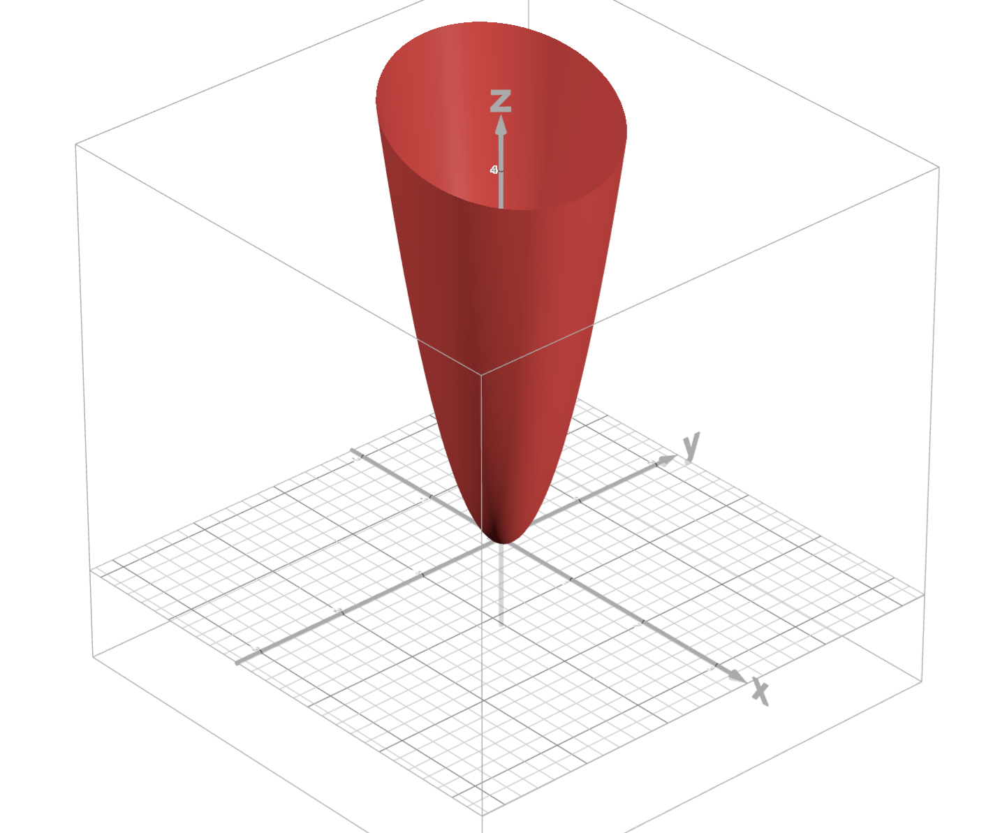
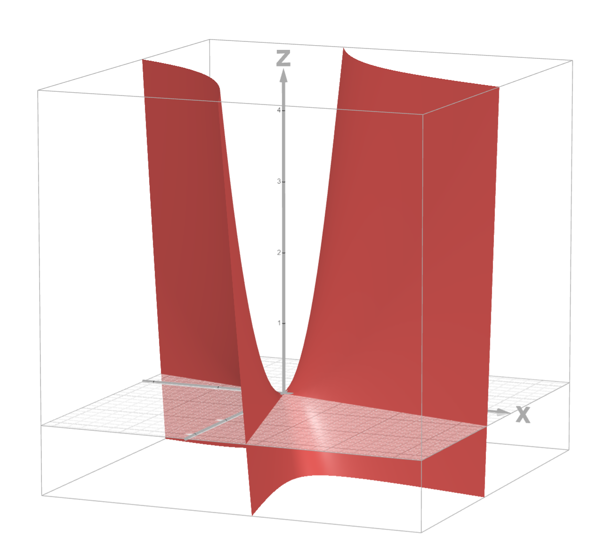

# Lyapunov Stability and Related Concepts

## Introduction

Lyapunov stability theory is a fundamental branch of dynamical systems theory, developed by the Russian mathematician Aleksandr Mikhailovich Lyapunov in the late 19th century. This theory provides methods for analyzing the behavior of dynamical systems without needing to explicitly solve the differential equations.

## Basic Concepts of Stability

### Lyapunov Stability

Consider a dynamical system described by the differential equation:

$\dot{x} = f(x)$

where $x \in \mathbb{R}^n$, and $f: \mathbb{R}^n \rightarrow \mathbb{R}^n$ is a continuously differentiable function.

An equilibrium state $x_0$ (such that $f(x_0) = 0$) is called **Lyapunov stable** if for every $\varepsilon > 0$, there exists a $\delta > 0$ such that if the initial state of the system is within a $\delta$-neighborhood of $x_0$, then the system's solution always remains within an $\varepsilon$-neighborhood of $x_0$.

This means that if the system starts close to the equilibrium position, it will never move far away from it.

### Asymptotic Stability

An equilibrium state is called **asymptotically stable** if it is Lyapunov stable and, additionally, there exists a $\delta > 0$ such that if the initial state of the system is within a $\delta$-neighborhood of $x_0$, then the solution approaches $x_0$ as $t \rightarrow \infty$.

In other words, the system not only stays close to the equilibrium position but also approaches it over time.

## Methods for Stability Analysis

### Lyapunov's Direct Method

The key idea of Lyapunov's direct method is to use a special function $L(x)$, called a **Lyapunov function**, which must satisfy certain conditions:

1. $L(x) > 0$ for all $x \neq x_0$ and $L(x_0) = 0$
2. $\frac{dL}{dt} \leq 0$ along any trajectory of the system

If such a function can be found, then the equilibrium position $x_0$ is Lyapunov stable. If, additionally, $\frac{dL}{dt} < 0$ for all $x \neq x_0$, then the equilibrium position is asymptotically stable.

## Simple Examples

### Example 1: Mathematical Pendulum Without Friction

Consider the equation of a mathematical pendulum without friction:

$\ddot{\theta} + \frac{g}{l}\sin(\theta) = 0$

where $\theta$ is the angle of deviation from the vertical, $g$ is the acceleration due to gravity, and $l$ is the length of the pendulum.

Rewrite this as a first-order system:

$\dot{\theta} = \omega$
$\dot{\omega} = -\frac{g}{l}\sin(\theta)$

The equilibrium position is: $\theta = 0$, $\omega = 0$.

A Lyapunov function for this system can be chosen as the total energy of the pendulum:

$$L(\theta, \omega) = \frac{l\omega^2}{2} + gl(1-\cos(\theta))$$

This function is positive for all $(\theta, \omega) \neq (0, 0)$ and is zero at the point $(0, 0)$.

The derivative of this function along the system trajectories is:

$$\dot{L} = l\omega\dot{\omega} + gl\sin(\theta)\dot{\theta} = $$
$$= l\omega\left(-\frac{g}{l}\sin(\theta)\right) + gl\sin(\theta)\omega$$
$$= 0$$

Since $\frac{dL}{dt} = 0$, the equilibrium position is Lyapunov stable, but not asymptotically stable (the pendulum will oscillate indefinitely).

### Example 1.1: Mathematical Pendulum in the Upper Position

Consider the same mathematical pendulum, but analyze its upper equilibrium position:

$\theta = \pi, \omega = 0$

For this equilibrium position, we can use the same energy function:

$L(\theta, \omega) = \frac{l\omega^2}{2} + gl(1-\cos(\theta))$

In the upper position at $\theta = \pi$, the value $\cos(\pi) = -1$, so $L(\pi, 0) = gl(1-(-1)) = 2gl > 0$. This contradicts the condition that the Lyapunov function must be zero at the equilibrium point.

To investigate the stability of the upper position, we can use the function:

$L(\theta, \omega) = \frac{l\omega^2}{2} + gl(\cos(\theta) + 1)$

At $\theta = \pi$, we have $L(\pi, 0) = gl(\cos(\pi) + 1) = gl(-1 + 1) = 0$, which satisfies the requirement.

The derivative of this function is:

$\dot{L} = l\omega\dot{\omega} - gl\sin(\theta)\dot{\theta}$
$= l\omega\left(-\frac{g}{l}\sin(\theta)\right) - gl\sin(\theta)\omega$
$= -2gl\sin(\theta)\omega$

Consider small deviations from the upper equilibrium position: $\theta = \pi + \phi$, where $\phi$ is a small deviation. Then $\sin(\pi + \phi) \approx -\sin(\phi) \approx -\phi$ for small $\phi$.

Therefore:
$\frac{dL}{dt} \approx -2gl(-\phi)\omega = 2gl\phi\omega$

If $\phi > 0$ and $\omega > 0$ (pendulum deviates to the right and moves right) or $\phi < 0$ and $\omega < 0$ (pendulum deviates to the left and moves left), then $\frac{dL}{dt} > 0$. This means the system's energy increases, contradicting the Lyapunov stability condition.

Thus, the upper position of the pendulum is unstable, which corresponds to physical intuition - a pendulum in the upper position easily "falls" with any slight disturbance.

### Example 2: Linear System

Consider the linear system:

$\dot{x} = Ax$

where $A$ is a constant $n \times n$ matrix.

For such a system, one can try to find a Lyapunov function in the form of a quadratic form:

$$L(x) = x^T P x$$

where $P$ is a positive definite symmetric matrix.

Recall that a **symmetric matrix** is a square matrix that is equal to its transpose, i.e., $P = P^T$, or in component notation $p_{ij} = p_{ji}$ for all $i, j$.

A **positive definite matrix** $P$ is a symmetric matrix for which the quadratic form $x^T P x > 0$ for all non-zero vectors $x$. Equivalent definitions:
1. All eigenvalues of the matrix $P$ are positive.
2. All principal minors of the matrix $P$ are positive (Sylvester's criterion).
3. There exists a non-singular matrix $S$ such that $P = S^T S$.

**Example of a suitable matrix:**
$P_1 = \begin{pmatrix} 2 & 1 \\ 1 & 3 \end{pmatrix}$

This matrix is symmetric since $p_{12} = p_{21} = 1$. Check its positive definiteness using Sylvester's criterion:
- First principal minor: $\det(2) = 2 > 0$
- Second principal minor: $\det\begin{pmatrix} 2 & 1 \\ 1 & 3 \end{pmatrix} = 2 \cdot 3 - 1 \cdot 1 = 6 - 1 = 5 > 0$

Both minors are positive, hence matrix $P_1$ is positive definite and can be used to construct a Lyapunov function.

To demonstrate positive definiteness, take an arbitrary non-zero vector, for example:
$x = \begin{pmatrix} 2 \\ 1 \end{pmatrix}$

Calculate the quadratic form $x^T P_1 x$:

$x^T P_1 x = \begin{pmatrix} 2 & 1 \end{pmatrix} \begin{pmatrix} 2 & 1 \\ 1 & 3 \end{pmatrix} \begin{pmatrix} 2 \\ 1 \end{pmatrix}$

First, find the product $P_1 x$:
$P_1 x = \begin{pmatrix} 2 & 1 \\ 1 & 3 \end{pmatrix} \begin{pmatrix} 2 \\ 1 \end{pmatrix} = \begin{pmatrix} 2 \cdot 2 + 1 \cdot 1 \\ 1 \cdot 2 + 3 \cdot 1 \end{pmatrix} = \begin{pmatrix} 5 \\ 5 \end{pmatrix}$

Now calculate $x^T (P_1 x)$:
$x^T (P_1 x) = \begin{pmatrix} 2 & 1 \end{pmatrix} \begin{pmatrix} 5 \\ 5 \end{pmatrix} = 2 \cdot 5 + 1 \cdot 5 = 15$

The result is 15, which is a positive number. This confirms that matrix $P_1$ is indeed positive definite, as stated in the section.

**Example of an unsuitable matrix:**
$P_2 = \begin{pmatrix} 1 & 2 \\ 2 & 1 \end{pmatrix}$

This matrix is also symmetric, but let's check its positive definiteness:
- First principal minor: $\det(1) = 1 > 0$
- Second principal minor: $\det\begin{pmatrix} 1 & 2 \\ 2 & 1 \end{pmatrix} = 1 \cdot 1 - 2 \cdot 2 = 1 - 4 = -3 < 0$

The second minor is negative, meaning matrix $P_2$ is not positive definite. If we take the vector $x = (1, -1)^T$, we get:
$x^T P_2 x = \begin{pmatrix} 1 & -1 \end{pmatrix} \begin{pmatrix} 1 & 2 \\ 2 & 1 \end{pmatrix} \begin{pmatrix} 1 \\ -1 \end{pmatrix} = \begin{pmatrix} 1 & -1 \end{pmatrix} \begin{pmatrix} 1 - 2 \\ 2 - 1 \end{pmatrix} = \begin{pmatrix} 1 & -1 \end{pmatrix} \begin{pmatrix} -1 \\ 1 \end{pmatrix} = 1(-1) + (-1)(1) = -2 < 0$

Thus, $P_2$ is unsuitable for a Lyapunov function, as the quadratic form $x^T P_2 x$ can take negative values.

The positive definiteness of matrix $P$ ensures that the function $L(x) = x^T P x$ is a positive definite function, which is necessary for a Lyapunov function.

If there exists a positive definite matrix $P$ such that:

$$A^T P + P A = -Q$$

where $Q$ is also a positive definite matrix, then the function $L(x)$ is a Lyapunov function for the given system, and the zero equilibrium position is asymptotically stable.

For the simplest case, consider the system:

$\dot{x} = -x$

Here $A = -1$. Choose $P = 1$ and we get $Q = 2$, which satisfies the conditions. The Lyapunov function $L(x) = x^2$ shows that the system is asymptotically stable, which is intuitively clear, as the solution to this equation $x(t) = x_0 e^{-t}$ tends to zero as $t \rightarrow \infty$.

### Example of a system with a 2x2 matrix

Consider a second-order linear system:

$\dot{x} = \begin{pmatrix} -2 & 1 \\ 0 & -3 \end{pmatrix} x$

Here the system matrix is $A = \begin{pmatrix} -2 & 1 \\ 0 & -3 \end{pmatrix}$.

Let's check the stability of this system in two ways:

1.  **By eigenvalues**: The eigenvalues of matrix $A$ are $\lambda_1 = -2$ and $\lambda_2 = -3$. Since both eigenvalues are negative, the system is asymptotically stable.

2.  **Using a Lyapunov function**: Let's try to find a positive definite matrix $P$ such that $A^T P + P A = -Q$, where $Q$ is also a positive definite matrix.

Let's choose $Q = I$ (the identity matrix) for simplicity. Then the equation for $P$ becomes:

$$A^T P + P A = -I$$

For our matrix $A$, this will be:

$$\begin{pmatrix} -2 & 0 \\ 1 & -3 \end{pmatrix} P + P \begin{pmatrix} -2 & 1 \\ 0 & -3 \end{pmatrix} = -\begin{pmatrix} 1 & 0 \\ 0 & 1 \end{pmatrix}$$

Denote the matrix $P$ as $P = \begin{pmatrix} p_{11} & p_{12} \\ p_{21} & p_{22} \end{pmatrix}$. Since $P$ must be symmetric, $p_{12} = p_{21}$.

The product $A^T P$:
$$A^T P = \begin{pmatrix} -2 & 0 \\ 1 & -3 \end{pmatrix} \begin{pmatrix} p_{11} & p_{12} \\ p_{12} & p_{22} \end{pmatrix} = \begin{pmatrix} -2p_{11} & -2p_{12} \\ p_{11}-3p_{12} & p_{12}-3p_{22} \end{pmatrix}$$

The product $P A$:
$$P A = \begin{pmatrix} p_{11} & p_{12} \\ p_{12} & p_{22} \end{pmatrix} \begin{pmatrix} -2 & 1 \\ 0 & -3 \end{pmatrix} = \begin{pmatrix} -2p_{11} & p_{11}-3p_{12} \\ -2p_{12} & p_{12}-3p_{22} \end{pmatrix}$$

Now sum $A^T P + P A$:
$$A^T P + P A = \begin{pmatrix} -4p_{11} & -2p_{12}+p_{11}-3p_{12} \\ p_{11}-3p_{12}-2p_{12} & 2(p_{12}-3p_{22}) \end{pmatrix}$$
$$= \begin{pmatrix} -4p_{11} & p_{11}-5p_{12} \\ p_{11}-5p_{12} & 2p_{12}-6p_{22} \end{pmatrix}$$

Equate this to $-I$:
$$\begin{pmatrix} -4p_{11} & p_{11}-5p_{12} \\ p_{11}-5p_{12} & 2p_{12}-6p_{22} \end{pmatrix} = \begin{pmatrix} -1 & 0 \\ 0 & -1 \end{pmatrix}$$

We get a system of equations:
$$-4p_{11} = -1$$
$$p_{11}-5p_{12} = 0$$
$$2p_{12}-6p_{22} = -1$$

Solving the system, we find:
$$p_{11} = \frac{1}{4}$$
$$p_{12} = \frac{1}{20}$$
$$p_{22} = \frac{1}{6} + \frac{1}{60} = \frac{11}{60}$$

Thus, the matrix $P = \begin{pmatrix} \frac{1}{4} & \frac{1}{20} \\ \frac{1}{20} & \frac{11}{60} \end{pmatrix}$.

Check that $P$ is positive definite:
1. First principal minor: $p_{11} = \frac{1}{4} > 0$
2. Determinant of matrix $P$:
   $$\det(P) = \frac{1}{4} \cdot \frac{11}{60} - \left(\frac{1}{20}\right)^2 = \frac{11}{240} - \frac{1}{400} = \frac{11 \cdot 5 - 6}{1200} = \frac{49}{1200} > 0$$

Both criteria are met, so $P$ is a positive definite matrix. We have constructed a Lyapunov function $L(x) = x^T P x$, confirming the asymptotic stability of the system.

### Example 3: Linearized Model of a Pendulum with Friction

Consider the linearized model of a pendulum with friction near the lower equilibrium position with specific parameter values:
- β (friction coefficient) = 0.5
- g (acceleration due to gravity) = 10 m/s²
- l (pendulum length) = 1 m

The equation of motion:

$\ddot{\theta} + 0.5\dot{\theta} + 10\theta = 0$

Rewrite this equation as a first-order system by introducing variables $x_1 = \theta$ and $x_2 = \dot{\theta}$:

$\dot{x}_1 = x_2$
$\dot{x}_2 = -10x_1 - 0.5x_2$

In matrix form:

$$\frac{dx}{dt} = Ax$$

where $x = \begin{pmatrix} x_1 \\ x_2 \end{pmatrix}$ and $A = \begin{pmatrix} 0 & 1 \\ -10 & -0.5 \end{pmatrix}$.

For the stability analysis, we apply Lyapunov's criterion by finding a positive definite matrix $P$ such that $A^T P + P A = -Q$, where $Q$ is also a positive definite matrix.

Let's choose $Q = I$ (the identity matrix) for simplicity. Then we need to solve the equation:

$$A^T P + P A = -I$$

The matrix $A^T = \begin{pmatrix} 0 & -10 \\ 1 & -0.5 \end{pmatrix}$.

Let $P = \begin{pmatrix} p_{11} & p_{12} \\ p_{12} & p_{22} \end{pmatrix}$, where we used the symmetry of $P$.

Calculate $A^T P$:
$$A^T P = \begin{pmatrix} 0 & -10 \\ 1 & -0.5 \end{pmatrix} \begin{pmatrix} p_{11} & p_{12} \\ p_{12} & p_{22} \end{pmatrix} = \begin{pmatrix} -10p_{12} & -10p_{22} \\ p_{11} - 0.5p_{12} & p_{12} - 0.5p_{22} \end{pmatrix}$$

Calculate $P A$:
$$P A = \begin{pmatrix} p_{11} & p_{12} \\ p_{12} & p_{22} \end{pmatrix} \begin{pmatrix} 0 & 1 \\ -10 & -0.5 \end{pmatrix} = \begin{pmatrix} -10p_{12} & p_{11} - 0.5p_{12} \\ -10p_{22} & p_{12} - 0.5p_{22} \end{pmatrix}$$

Sum $A^T P + P A$:
$$A^T P + P A = \begin{pmatrix} -20p_{12} & p_{11} - 0.5p_{12} - 10p_{22} \\ p_{11} - 0.5p_{12} - 10p_{22} & 2(p_{12} - 0.5p_{22}) \end{pmatrix}$$

Equate this to $-I$:
$$\begin{pmatrix} -20p_{12} & p_{11} - 0.5p_{12} - 10p_{22} \\ p_{11} - 0.5p_{12} - 10p_{22} & 2(p_{12} - 0.5p_{22}) \end{pmatrix} = \begin{pmatrix} -1 & 0 \\ 0 & -1 \end{pmatrix}$$

We get a system of equations:
$$-20p_{12} = -1$$
$$p_{11} - 0.5p_{12} - 10p_{22} = 0$$
$$2(p_{12} - 0.5p_{22}) = -1$$

Solving the system, we find:

From the first equation: 
$$p_{12} = \frac{1}{20} = 0.05$$

From the third equation: 
$$p_{12} - 0.5p_{22} = -\frac{1}{2}$$
$$p_{22} = \frac{1}{0.5}(p_{12} + \frac{1}{2}) = \frac{1}{0.5}(0.05 + \frac{1}{2}) = \frac{1}{0.5} \cdot 0.55 = 1.1$$

From the second equation: 
$$p_{11} = 0.5p_{12} + 10p_{22} = 0.5 \cdot 0.05 + 10 \cdot 1.1 = 0.025 + 11 = 11.025$$

So, the matrix 
$$P = \begin{pmatrix} 11.025 & 0.05 \\ 0.05 & 1.1 \end{pmatrix}$$

Check that $P$ is positive definite:

1. First principal minor: $p_{11} = 11.025 > 0$

2. Determinant of matrix $P$:
   $$\det(P) = 11.025 \cdot 1.1 - 0.05^2 = 12.1275 - 0.0025 = 12.125 > 0$$

Both criteria are met, so $P$ is a positive definite matrix. We have constructed a Lyapunov function:

$$L(x) = x^T P x = 11.025 x_1^2 + 0.1 x_1 x_2 + 1.1 x_2^2$$

This confirms the asymptotic stability of the lower equilibrium position of the pendulum with the given parameters.

Physically, this means that with a friction coefficient β = 0.5, a pendulum of length l = 1 m, and initially deviated from the equilibrium position, will return to this position and stop over time. This is consistent with our intuition and experience.

## Related Concepts

### Exponential Stability

A system is called **exponentially stable** if there exist positive constants $M$ and $\lambda$ such that for any solution $x(t)$ with initial condition $x(0)$ the following holds:

$$\|x(t)\| \leq M \|x(0)\| e^{-\lambda t}$$

This is a stronger property than asymptotic stability, as it guarantees not only approach to equilibrium but also a certain rate of this approach.

### Orbital Stability

In the case of periodic solutions, one speaks of **orbital stability** - the property of a trajectory remaining close to the unperturbed periodic trajectory even if the phases may differ.

### Structural Stability

**Structural stability** is the property of a dynamical system to maintain qualitative behavior under small perturbations of the system parameters. This concept was introduced by Andronov and Pontryagin.

## Conclusion

Lyapunov stability theory is a powerful tool for analyzing the behavior of dynamical systems. It finds application in various fields of science and technology, including control theory, mechanics, electrical engineering, economics, and even biology. Understanding different types of stability and methods for their analysis allows predicting the behavior of complex systems without needing to find their exact solutions.