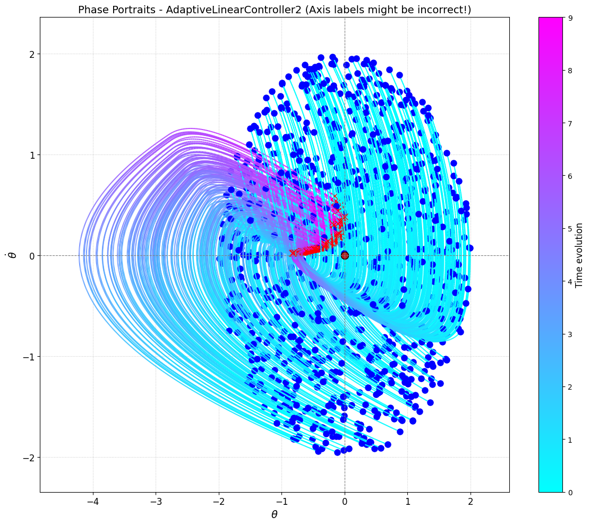

# Seminar 5: Adaptive Control for a 1D System

This seminar introduces the concept of adaptive control using a simple one-dimensional system example. The goal is to design a controller that can maintain desired system performance despite unknown parameters or disturbances, in this case, an unknown constant wind force.

## Contents

1.  **Code Structure:** Using Abstract Base Classes (`System`, `Controller`).
2.  **System Model:** The "Lighthouse Keeper" 1D system with unknown constant wind disturbance.
3.  **Controllers:** Implementation of non-adaptive (Zero, Linear Feedback, Bang-Bang) and adaptive linear controllers (`AdaptiveLinearController`, `AdaptiveLinearController2`).
4.  **Adaptive Control:** Introduction to disturbance estimation and cancellation using an adaptation law (potentially gradient-based and/or with modifications like leakage).
5.  **Simulation & Analysis:** Comparing performance and disturbance estimate convergence for adaptive vs. non-adaptive controllers.

## Key Topics

*   Adaptive Control
*   Parameter Estimation / Disturbance Estimation
*   Disturbance Rejection
*   Adaptation Laws (Gradient-based, Sigma-modification/Leakage)
*   Lyapunov-based Design (implied for adaptation law)
*   Abstract Base Classes for Code Structuring
*   Simulation of Dynamic Systems

## Mathematical Foundation

*   System Dynamics: $\ddot{x} = a + w$ (where $w$ is unknown)
*   State Vector: $\mathbf{s} = [x, \dot{x}]^T$
*   Adaptive Control Law Structure: $a = a_{nominal}(\mathbf{s}) - \hat{w}$
*   Adaptation Law Concept: $ \dot{\hat{w}} = \text{projection}(\gamma \cdot \text{error\_signal}) $ (where $\gamma$ is adaptation gain)

## Files in Directory

*   `seminar_5_solution.ipynb`: The main Jupyter Notebook. Contains theory, system/controller definitions, simulation setup, and visualization.
*   `img/`: Contains generated plots:
    *   `output.png`: Visualization of simulation results, showing disturbance estimate convergence.
*   `src/`: Contains Python modules. Note: Some files are unused copies from other seminars.
    *   `system.py`: Defines the abstract `System` base class.
    *   `controller.py`: Defines the abstract `Controller` base class and non-adaptive controllers.
    *   `controller_adaptive.py`: Contains the implementation of `AdaptiveLinearController` and `AdaptiveLinearController2`.
    *   `simulator.py`: (Used by notebook) Class/functions for running simulations.
    *   `plotter.py`: (Used by notebook) Plotting utilities.
    *   `pendulum.py`: (Unused) Pendulum model, not the Lighthouse Keeper.
    *   `adaptation_log/`: Directory where adaptive controllers save log files of parameter estimates.
    *   `__init__.py`: Makes the directory a Python package.
*   `README.md`: This file.

## Running the Code

*   **Jupyter Notebook:** Open and run cells in `seminar_5_solution.ipynb`. Needs `numpy`, `matplotlib`.

## Key Visualization: Adaptive Performance

_(The `output.png` image likely displays the evolution of the disturbance estimate $\hat{w}$ over time for multiple adaptive controller simulations, showing convergence towards the true unknown wind value $w$.)_ 